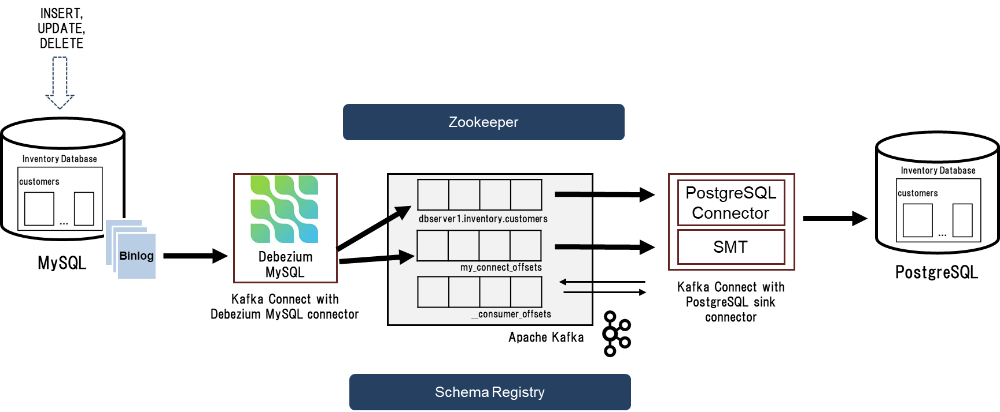

# Data Replication from MySQL to PostgreSQL with Change Data Capture tool, Debezium
## _About Project_

The project allows the users to replicate the data from MySQL database to PostgreSQL using an open source platform for change data capture. The process is achieved with just few configurations without any code. All the row level  ‘INSERT’, ‘UPDATE’ or ‘DELETE’ operations on any tables of MySQL database can be captured as a change event with the help of a MySQL source connector and PostgreSQL sink connector. The change events are stored in Kafka from where client applications can read and use these events as per their use cases. MySQL has a binary log (binlog) that records any changes in the schema of table or any ‘INSERT’, ‘UPDATE’ or ‘DELETE’ operations on the table in the order in which they are committed. MySQL Debezium source connector reads the binlog sequentially, produce these change data events and store it in their respective Kafka topics. The PostgreSQL sink connectors help in transforming these complex change events to the format understandable by the PostgreSQL with the help of Single Message Transformations (SMTs).   



The following are the steps we will go through in this project
- Spin up docker containers of Apacha Kafka, Zookeeper, Kafka Connect, MySQL, Schema Registry
- Configure Debezium MySQL source connector and PostgreSQL sink connector to the Kafka Connect
- Use a commandline tool for interacting with Kafka broker to check change data events
- Insert, Update or Delete data from Customers table in Inventory database of MySQL
- Capture data change events in near real time and store it in the Kafka topics
- Consume the change data events from the Kafka topics and transform the data into the respective operations on PostgreSQL database

## What is Debezium?

The official page of [Debezium] says: 

> Debezium is an open-source distributed platform for change data capture. Start it up, point it at your databases, and your apps can start responding to all of the inserts, updates, and deletes that other apps commit to your databases. Debezium is durable and fast, so your apps can respond quickly and never miss an event, even when things go wrong.

## Running the Project

Clone the repository

```sh
$ git clone https://github.com/AmanLonare/CDC-MySQL-Debezium-PostgreSQL.git
```
Change the directory to "Debezium-CDC-MySQL"

```sh
$ cd CDC-MySQL-Debezium-PostgreSQL/
```
The folder consist of a docker compose file and configuration file for configuring Debezium MySQL source connector to Kafka Connect. Run the docker compose file with the following command to spin up all the necssary components for running the project

```sh
$ docker-compose -f docker-compose-mysql-dbz-postgres.yml up -d
```

This will start up five containers as show below

```sh
$ docker ps 

CONTAINER ID   IMAGE                                COMMAND                  CREATED         STATUS         PORTS
                                                               NAMES
a226942400b5   debezium/connect-jdbc:1.9            "/docker-entrypoint.…"   6 minutes ago   Up 6 minutes   0.0.0.0:50
05->5005/tcp, 0.0.0.0:8083->8083/tcp, 9092/tcp                 cdc-mysql-debezium-postgresql_connect_1
00b256eb8763   quay.io/debezium/kafka:1.9           "/docker-entrypoint.…"   6 minutes ago   Up 6 minutes   0.0.0.0:90
92->9092/tcp                                                   cdc-mysql-debezium-postgresql_kafka_1
6c37ba47fdc3   quay.io/debezium/postgres:9.6        "docker-entrypoint.s…"   6 minutes ago   Up 6 minutes   0.0.0.0:54
32->5432/tcp                                                   cdc-mysql-debezium-postgresql_postgres_1
f5be0502d4a4   quay.io/debezium/zookeeper:1.9       "/docker-entrypoint.…"   6 minutes ago   Up 6 minutes   0.0.0.0:21
81->2181/tcp, 0.0.0.0:2888->2888/tcp, 0.0.0.0:3888->3888/tcp   cdc-mysql-debezium-postgresql_zookeeper_1
b4bd2bbeabda   quay.io/debezium/example-mysql:1.9   "docker-entrypoint.s…"   6 minutes ago   Up 6 minutes   0.0.0.0:33
06->3306/tcp, 33060/tcp                                        cdc-mysql-debezium-postgresql_mysql_1

```
We have an enriched Kafka Connect / Debezium image with few changes
-   PostgreSQL JDBC driver placed into /kafka/libs directory
-   The Confluent JDBC connector placed into /kafka/connect/kafka-connect-jdbc directory

You can confirm these changes by logging into the Kafka connect docker container and checking libs/ and connect/ folders.

The MySQL container already has an example database created for us. We can log into the container's database to check the database and tables inside it

```sh
$ docker exec -it <container_id_of_MySQL> bash
root@0fe701a833c8:/# mysql -u mysqluser -p
Enter password: 
```
Enter the password as "mysqlpw". You can find the password in the docker compose file too where the MySQL container's configurations are defined. Once you log in successfully, you will see the following message. You can check the database and tables inside using simple SQL commands

```sh
$ docker exec -it <container_id_of_MySQL> bash
root@0fe701a833c8:/# mysql -u mysqluser -p
Enter password: 
Welcome to the MySQL monitor.  Commands end with ; or \g.
Your MySQL connection id is 8
Server version: 8.0.29 MySQL Community Server - GPL

Copyright (c) 2000, 2022, Oracle and/or its affiliates.

Oracle is a registered trademark of Oracle Corporation and/or its
affiliates. Other names may be trademarks of their respective
owners.

Type 'help;' or '\h' for help. Type '\c' to clear the current input statement.

$ mysql> SHOW databases;
+--------------------+
| Database           |
+--------------------+
| information_schema |
| inventory          |
+--------------------+
2 rows in set (0.01 sec)

mysql> use inventory;
Reading table information for completion of table and column names
You can turn off this feature to get a quicker startup with -A

Database changed
mysql> SHOW TABLES;
+---------------------+
| Tables_in_inventory |
+---------------------+
| addresses           |
| customers           |
| geom                |
| orders              |
| products            |
| products_on_hand    |
+---------------------+
6 rows in set (0.00 sec)
```
We can also use the Kakfa connect REST API to check the status of the Kafka Connect service.  Kafka Connect exposes a REST API to manage Debezium connectors. To communicate with the Kafka Connect service, you can use the curl command to send API requests to port 8083 of the Docker host (which you mapped to port 8083 in the connect container when you started Kafka Connect).

```sh
$ curl -H "Accept:application/json" localhost:8083/
{"version":"3.1.0","commit":"cb8625948210849f"}
```

We can also check the list of connectors registered with Kafka Connect using the following command (since there are no connectors registered with the Kafka Connect, it will show an empty list)

```sh
$ curl -H "Accept:application/json" localhost:8083/connectors/
[]
```
Next step is to register the Debezium MySQL connector with the Kafka Connect. The following command uses the Kafka Connect service’s API to submit a POST request against the /connectors resource with a JSON document that describes the new connector (called inventory-connector).

```sh
$ curl -i -X POST -H "Accept:application/json" -H "Content-Type:application/json" localhost:8083/connectors/ --data "@mysql-source-config.json" 

HTTP/1.1 201 Created
Date: Wed, 13 Jul 2022 00:32:07 GMT
Location: http://localhost:8083/connectors/inventory-connector
Content-Type: application/json
Content-Length: 681
Server: Jetty(9.4.44.v20210927)

{"name":"inventory-connector","config":{"connector.class":"io.debezium.connector.mysql.MySqlConnector","tasks.max":"1","database.hostname":"mysql","database.port":"3306","database.user":"debezium","database.password":"dbz","database.server.id":"184054","database.server.name":"dbserver1","database.include.list":"inventory","database.history.kafka.bootstrap.servers":"kafka:9092","database.history.kafka.topic":"schema-changes.inventory","transforms":"route","transforms.route.type":"org.apache.kafka.connect.transforms.RegexRouter","transforms.route.regex":"([^.]+)\\.([^.]+)\\.([^.]+)","transforms.route.replacement":"$3","name":"inventory-connector"},"tasks":[],"type":"source"}
```

If we check again the connectors registered with the Kafka Connect, we will find "inventory-connector" in the list of connectors

```sh
$ curl -H "Accept:application/json" localhost:8083/connectors/

["inventory-connector"]
```

Now we will register the PostgreSQL sink connector with the configurations defined in the "postgres-sink-config.json" file with the following command

```sh
$ curl -i -X POST -H "Accept:application/json" -H  "Content-Type:application/json" http://localhost:8083/connectors/ -d @postgres-sink-config.json

HTTP/1.1 201 Created
Date: Sun, 03 Jul 2022 15:27:29 GMT
Location: http://localhost:8083/connectors/jdbc-sink
Content-Type: application/json
Content-Length: 521
Server: Jetty(9.4.43.v20210629)

{"name":"jdbc-sink","config":{"connector.class":"io.confluent.connect.jdbc.JdbcSinkConnector","tasks.max":"1","topics":"customers","connection.url":"jdbc:postgresql://postgres:5432/inventory?user=postgresuser&password=postgrespw","transforms":"unwrap","transforms.unwrap.type":"io.debezium.transforms.ExtractNewRecordState","transforms.unwrap.drop.tombstones":"false","auto.create":"true","insert.mode":"upsert","delete.enabled":"true","pk.fields":"id","pk.mode":"record_key","name":"jdbc-sink"},"tasks":[],"type":"sink"}
```
If you check the connectors list again, you will find two connectors registered with our Kafka Connect instance

```sh
$ curl -H "Accept:application/json" localhost:8083/connectors/ 

["inventory-connector", "jdbc-sink"]
```

We will use a CommandLine tool [kafkacat] for interacting with Kafka brokers. Before using kafkacat, you show know the network in which your containers are running. Docker compose command will vreate a default network for you where all the containers are running together. In my case the name of the default network is "debezium-cdc-mysql_default".

```sh
$ docker network ls

NETWORK ID     NAME                                 DRIVER    SCOPE
294ee1ef5251   bridge                               bridge    local
9222d05266cf   debezium-cdc-mysql_default           bridge    local
96dab83c6348   host                                 host      local
437726dd9735   none                                 null      local
```

Following command will show all the topics present in the our Kafka broker. The Kafka automatically creates topics with names of the topics as per the names of the tables. 

```sh
$ docker run --tty --network <your_network_name>  confluentinc/cp-kafkacat kafkacat -b kafka:9092 -L
```

You will see Kafka topics names like "dbserver1", "dbserver1.inventory.geom", "dbserver1.inventory.addresses", "dbserver1.inventory.orders", "dbserver1.inventory.products_on_hand", "dbserver1.inventory.products", "dbserver1.inventory.customers" which are named as per the tables present in the "inventory" database. 

Now we will capture the changes in the "Customer" table in the "Inventory" database by tailing the dbserver1.inventory.customers topic with the following command

```sh
$ docker run --tty --network debezium-cdc-mysql_default confluentinc/cp-kafkacat kafkacat -b kafka:9092 -C -K: -f '\nKey (%K bytes): %k\t\nValue (%S bytes): %s\n\Partitio
n: %p\tOffset: %o\n--\n' -t dbserver1.inventory.customers
```

You can see complex events structure describing the schema, before, after field of each row of the database. The following is an example of one of the events from the "customers" tables

```sh
Key (168 bytes): {"schema":{"type":"struct","fields":[{"type":"int32","optional":false,"field":"id"}],"optional":false,"name":"dbserver1.inventory.customers.Key"},"payload":{"id":1004}}
Value (2486 bytes): {"schema":{"type":"struct","fields":[{"type":"struct","fields":[{"type":"int32","optional":false,"field":"id"},{"type":"string","optional":false,"field":"first_name"},{"type":"string","optional":false,"field":"last_name"},{"type":"string","optional":false,"field":"email"}],"optional":true,"name":"dbserver1.inventory.customers.Value","field":"before"},{"type":"struct","fields":[{"type":"int32","optional":false,"field":"id"},{"type":"string","optional":false,"field":"first_name"},{"type":"string","optional":false,"field":"last_name"},{"type":"string","optional":false,"field":"email"}],"optional":true,"name":"dbserver1.inventory.customers.Value","field":"after"},{"type":"struct","fields":[{"type":"string","optional":false,"field":"version"},{"type":"string","optional":false,"field":"connector"},{"type":"string","optional":false,"field":"name"},{"type":"int64","optional":false,"field":"ts_ms"},{"type":"string","optional":true,"name":"io.debezium.data.Enum","version":1,"parameters":{"allowed":"true,last,false,incremental"},"default":"false","field":"snapshot"},{"type":"string","optional":false,"field":"db"},{"type":"string","optional":true,"field":"sequence"},{"type":"string","optional":true,"field":"table"},{"type":"int64","optional":false,"field":"server_id"},{"type":"string","optional":true,"field":"gtid"},{"type":"string","optional":false,"field":"file"},{"type":"int64","optional":false,"field":"pos"},{"type":"int32","optional":false,"field":"row"},{"type":"int64","optional":true,"field":"thread"},{"type":"string","optional":true,"field":"query"}],"optional":false,"name":"io.debezium.connector.mysql.Source","field":"source"},{"type":"string","optional":false,"field":"op"},{"type":"int64","optional":true,"field":"ts_ms"},{"type":"struct","fields":[{"type":"string","optional":false,"field":"id"},{"type":"int64","optional":false,"field":"total_order"},{"type":"int64","optional":false,"field":"data_collection_order"}],"optional":true,"field":"transaction"}],"optional":false,"name":"dbserver1.inventory.customers.Envelope"},"payload":{"before":null,"after":{"id":1004,"first_name":"Anne","last_name":"Kretchmar","email":"annek@noanswer.org"},"source":{"version":"1.9.4.Final","connector":"mysql","name":"dbserver1","ts_ms":1656817172212,"snapshot":"true","db":"inventory","sequence":null,"table":"customers","server_id":0,"gtid":null,"file":"mysql-bin.000003","pos":157,"row":0,"thread":null,"query":null},"op":"r","ts_ms":1656817172212,"transaction":null}}
Partition: 0    Offset: 3

% Reached end of topic dbserver1.inventory.customers [0] at offset 4
--
```

As you can see, the current offset is 3 with 4 messages. In the new terminal we can log into the MySQL container as we did before and make any changes to the "customers" table. New event can be seen instantly in the terminal where we ran kafkacat for tailing "customers" table. You can check the following [repository] if you want to see how the change events are emitted whenever there is any 'INSERT', 'UPDATE', or 'DELETE'.

```sh
mysql> use inventory;
Reading table information for completion of table and column names
You can turn off this feature to get a quicker startup with -A    

Database changed
mysql> SELECT * FROM customers;
+------+------------+-----------+-----------------------+
| id   | first_name | last_name | email                 |
+------+------------+-----------+-----------------------+
| 1001 | Sally      | Thomas    | sally.thomas@acme.com |
| 1002 | George     | Bailey    | gbailey@foobar.com    |
| 1003 | Edward     | Walker    | ed@walker.com         |
| 1004 | Anne       | Kretchmar | annek@noanswer.org    |
+------+------------+-----------+-----------------------+
4 rows in set (0.00 sec)

```

Next we will look at our PostgreSQL database. Now remember that our PostgreSQL database did not have any database initially. We will log into our PostgreSQL container and check if the container has some data or not. The follwoing are the commands to execute our task. The username is "postgresuser" and the name of the database is "inventory". You can exit from the container using "\q" command.

```sh
$ docker exec -it 6c37ba47fdc3 bash
root@6c37ba47fdc3:/# psql -U postgresuser inventory
psql (9.6.24)
Type "help" for help.

inventory=# SELECT * FROM customers;
 last_name |  id  | first_name |         email
-----------+------+------------+-----------------------
 Thomas    | 1001 | Sally      | sally.thomas@acme.com
 Bailey    | 1002 | George     | gbailey@foobar.com
 Walker    | 1003 | Edward     | ed@walker.com
 Kretchmar | 1004 | Anne       | annek@noanswer.org
(4 rows)

inventory=#
```

Here we can see that the "customers" table from MySQL example database has been successfully replicated to PostgreSQL with very few configurations and very low code. Similarly you can configure the supported database connector by Debezium with the Kafka Connect and stream data changes from the source database to the sink database with appropriate connectors and SMTs. 


[//]: # (These are reference links used in the body of this note and get stripped out when the markdown processor does its job. There is no need to format nicely because it shouldn't be seen. Thanks SO - http://stackoverflow.com/questions/4823468/store-comments-in-markdown-syntax)

   
   [Debezium]: <https://debezium.io/> 
   [kafkacat]: <https://hub.docker.com/r/confluentinc/cp-kafkacat>
   [repository]: <https://github.com/AmanLonare/Debezium-CDC-MySQL>
   [JSON beautifier]: <https://codebeautify.org/jsonviewer>
   [PlDb]: <https://github.com/joemccann/dillinger/tree/master/plugins/dropbox/README.md>
   [PlGh]: <https://github.com/joemccann/dillinger/tree/master/plugins/github/README.md>
   [PlGd]: <https://github.com/joemccann/dillinger/tree/master/plugins/googledrive/README.md>
   [PlOd]: <https://github.com/joemccann/dillinger/tree/master/plugins/onedrive/README.md>
   [PlMe]: <https://github.com/joemccann/dillinger/tree/master/plugins/medium/README.md>
   [PlGa]: <https://github.com/RahulHP/dillinger/blob/master/plugins/googleanalytics/README.md>
